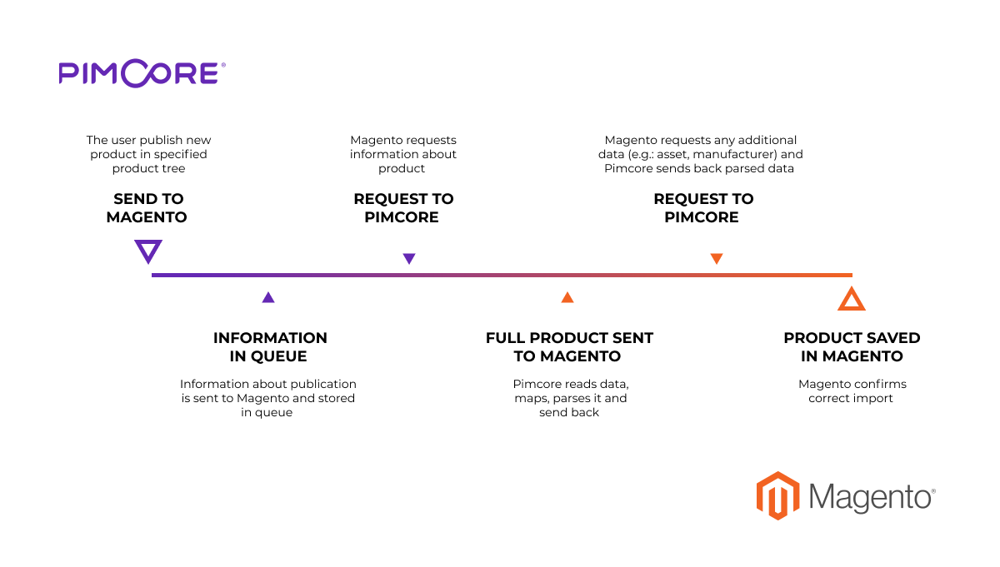
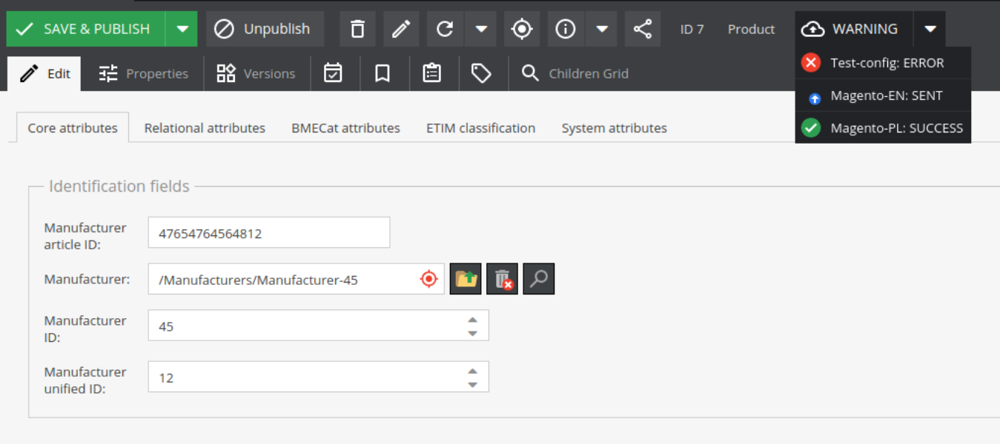

# <a name="integration-module"></a>Pimcore 5 Module Magento 2 Integration

This module is a part (1/2) of the Pimcore - Magento connector. 
It allows for the integration of your Pimcore platform with the Magento 2 e-commerce platform, including synchronization of **products**, **categories** and **assets**.

The second part of this module (Magento 2 - Pimcore Integration Module) is available at [DivanteLtd/magento2-pimcore-bridge](https://github.com/DivanteLtd/magento2-pimcore-bridge). 

**Table of Contents**

- [Pimcore 5 Module Magento 2 Integration](#integration-module)
	- [Description](#description)
	- [Compatibility](#compatibility)
	- [Requirements](#requirements)
	- [Installing/Getting started](#installing)
	- [Usage/Setting up](#usage)
	- [Features](#features)
	- [Supported Pimcore types](#supported-types)
	- [Contributing](#contributing)
	- [Licensing](#licensing)
	- [Standards & Code Quality](#standards)
	- [About the Author](#authors)
	
## <a name="description"></a>Description	
This plugin allows Pimcore to send all data about products and categories to remote eCommerce systems.

## <a name="compatibility"></a>Compatibility	
This module is compatible with Pimcore 5.2 and above.

## <a name="requirements"></a>Requirements
Before getting started, please install: [DivanteLtd/pimcore-devkit](https://github.com/DivanteLtd/pimcore-devkit)
[DivanteLtd/pimcore5-notifications](https://github.com/DivanteLtd/pimcore5-notifications)
[coreshop/resource-bundle](https://github.com/coreshop/ResourceBundle)

## <a name="installing"></a>Installing/Getting started	
- Open your Pimcore
- Install Pimcore 5 Module Magento 2 Integration via composer ```composer require divante-ltd/pimcore-magento2-bridge:dev```
- Enable bundles by running ```bin/console pimcore:bundle:enable DivanteMagentoIntegrationBundle```, ```bin/console pimcore:bundle:enable DivanteObjectMapperBundle``` and ```bin/console pimcore:bundle:enable CoreShopResourceBundle```
- Clear cache by running ```bin/console cache:clear --no-warmup```
- Install Bundle by running ```bin/console pimcore:bundle:install DivanteMagentoIntegrationBundle```
- Reload Pimcore
- Create a new object of class IntegrationConfiguration

## <a name="usage"></a>Usage/Setting up

- Go to Settings>Authorisation in your Pimcore panel.
- Fill in **Magento URL** and **Client Secret** with the authorisation data from your Magento2.
- Save class and reload it.
- If credentials are correct, please select **Magento store**. In the other case a "**Could not fetch stores**" value will be displayed and the authorization data should be checked.
- Select classes that are used as a product and category classes.
- Select products and categories synchronization root. When an object of one of the selected classes is published in the given root directory, it will be sent to Magento.
- Select the default language used in synchronization. If a product has localized fields, only one version of this field will be sent.
- Select the default classification store used in communication. This classification store will be used as an attribute set in Magento.
- Go to Settings>Mappings in your Pimcore panel.
- Fill in the left column with names of your fields in your classes. These attribute names will be mapped to the correct names used in communication with Magento.
- Save and publish the Integration Configuration object.

## <a name="features"></a>Features
- The general Pimcore to Magento communication scheme goes as follows:

- When a product/category meets the criteria (published, in the selected root tree, has the correct type), information about publication is sent to Magento.
- Magento sends a request to Pimcore to fetch object data and Pimcore responds with a parsed, mapped object.
- Endpoints for fetching mapped products, categories.
- Indicators on product and category views that show synchronization status. Available synchronization statuses: Sent, OK, Error, Deleted.

- Any problem reported by Magento will be stored in object notes and inside Tools -> Application Logger.
- All assets, if attached to any synchronized product, when updated, will be sent to Magento.
- Unpublished products will be sent to Magento as deleted. In order to disable a product, set the **Enable** property to *false*.

## <a name="supported-types"></a>Supported Pimcore types
- Text
- Number
- Date
- Select
- Relation
- Classification store
- Object bricks
- Localized fields
- Image
- Image gallery
 
## <a name="contributing"></a>Contributing

If you'd like to contribute, please fork the repository and use a feature branch. Pull requests are warmly welcome.

## <a name="licensing"></a>Licensing
The code in this project is licensed under the MIT license.

## <a name="standards"></a>Standards & Code Quality
This module respects PSR-2 code quality rules and our own PHPCS and PHPMD rulesets.

## <a name="authors"></a>About the Author

This module has been created by Divante eCommerce Software House.


Divante is an expert in providing top-notch eCommerce solutions and products for both B2B and B2C segments. Our core competencies are built around Magento, Pimcore and bespoke software projects (we love Symfony3, Node.js, Angular, React, Vue.js). We specialize in sophisticated integration projects trying to connect hardcore IT with good product design and UX.

We work with industry leaders, like T-Mobile, Continental, and 3M, who perceive technology as their key component to success. In Divante, we trust in cooperation, that's why we contribute to open source products and create our own products like [Open Loyalty](http://www.openloyalty.io/ "Open Loyalty") and [Vue Storefront](https://github.com/DivanteLtd/vue-storefront "Vue Storefront").

Divante is part of the OEX Group which is listed on the Warsaw Stock Exchange. Our annual revenue has been growing at a minimum of about 30% year on year.

For more information please visit [Divante.co](https://divante.co/ "Divante.co").
