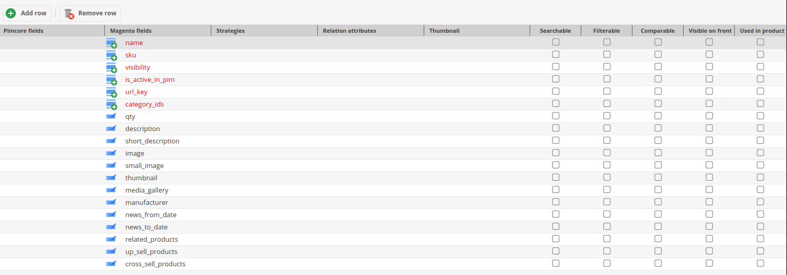
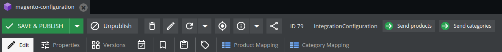

# <a name="integration-module"></a>Pimcore 5 & 6 Module Magento 2 Integration

This module is a part (1/2) of the Pimcore - Magento connector. 
It allows for the integration of your Pimcore platform with the Magento 2 e-commerce platform, including synchronization of **products**, **categories** and **assets**.

The second part of this module (Magento 2 - Pimcore Integration Module) is available at [DivanteLtd/magento2-pimcore-bridge](https://github.com/DivanteLtd/magento2-pimcore-bridge). 

**Table of Contents**

- [Pimcore 5 & 6 Module Magento 2 Integration](#integration-module)
	- [Description](#description)
	- [Compatibility](#compatibility)
	- [Installing/Getting started](#installing)
	- [Usage/Setting up](#usage)
	- [Features](#features)
	- [Supported Pimcore types](#supported-types)
	- [Custom Strategies](#custom-strategies)
	- [Validators](#validators)
	- [Bulk Magento notification](#bulk-notification)
	- [Contributing](#contributing)
	- [Licensing](#licensing)
	- [Standards & Code Quality](#standards)
	- [About the Author](#authors)
	
## <a name="description"></a>Description	
This plugin allows Pimcore to send all data about products and categories to remote eCommerce systems.

## <a name="compatibility"></a>Compatibility	
This module is compatible with Pimcore >= 5.4 and Pimcore 6.0.

## <a name="installing"></a>Installing/Getting started	
- Open your Pimcore
- Install Pimcore 5 Module Magento 2 Integration via composer ```composer require divante-ltd/pimcore-magento2-bridge```
- Enable bundle by running  ```bin/console pimcore:bundle:enable DivanteMagentoIntegrationBundle```
- Clear cache by running ```bin/console cache:clear --no-warmup```
- Install Bundle by running ```bin/console pimcore:bundle:install DivanteMagentoIntegrationBundle```
- Reload Pimcore
- Create a new object of class IntegrationConfiguration

## <a name="usage"></a>Usage/Setting up

- First, give your configuration an unique ID.
- Next, you have to configure `Authorization` section.
- Fill in **Magento URL** and **Client Secret** with the authorisation data from your Magento2.
- Save class and reload it.
- If credentials are correct, please select **Magento store**. In the other case a "**Could not fetch stores**" value will be displayed and the authorization data should be checked.
- When this is set, fill the `Mappings settings` section.
- Select the checkbox if only mapped fields should be sent to Magento. Otherwise all object attributes will be sent.
- Select classes that are used as a product and category classes.
- When filled, two tabs should appear in the object toolbar menu. We will discuss it later.
- Select products and categories synchronization root. When an object of one of the selected classes is published in the given root directory, it will be sent to Magento.
- Select the default language used in synchronization. If a product has localized fields, only one version of this field will be sent.
- Select the default classification store used in communication. This classification store will be used as an attribute set in Magento.
- To finish your configuration, you have to set mappings between Pimcore fields and Magento fields. This is our next chapter.

## <a name="mappings"></a>Mappings

- Product and Category mappings are basically the same mechanism, except for attribute configuration which is done only for products.
- Above the table you have two buttons, to add a row and to remove the last row. You can also remove a row by right clicking it and selecting delete.
- You can't remove required fields by Magento. There are coloured in red.
- You can also rename magento fields. Except the required ones.
- In the first column, select Pimcore fields you want to be mapped as Magento fields.
- The third column is to select a strategy. It can stay empty. (more info about strategies [here](#custom-strategies)
- The fourth column is also linked with strategy and you don't have to fill it up either. (more info about strategies [here](#custom-strategies)
- Next column is named `Thumbnail` it has to be filled only if you send picture to Magento and don't want to send full size image but only a thumbnail.
- The last five columns are called attribute configuration. You can select if in magento this field will be searchable, filterable, comparable, visible and used in product.
- Category configuration works the same, but you don't have all these checkboxes.

## <a name="features"></a>Features
- The general Pimcore to Magento communication scheme goes as follows:

- When a product/category meets the criteria (published, in the selected root tree, has the correct type), information about publication is sent to Magento.
- Magento sends a request to Pimcore to fetch object data and Pimcore responds with a parsed, mapped object.
- Endpoints for fetching mapped products, categories.
- Indicators on product and category views that show synchronization status. Available synchronization statuses: Sent, Success, Error, Deleted.

- Any problem reported by Magento will be stored in object notes and inside Tools -> Application Logger.
- All assets, if attached to any synchronized product, when updated, will be sent to Magento.
- Unpublished products will be sent to Magento as deleted. In order to disable a product, set the **Enable** property to *false*.

## <a name="supported-types"></a>Supported Pimcore types
- Text
- Number
- Date
- Select
- Relation
- Classification store
- Object bricks
- Localized fields
- Image
- Image gallery

## <a name="custom-strategies"></a>Custom Strategies
If you have a type that is not supported or want, for a specific attribute, to be mapped differently than the standard way,
you can define a custom strategy.

It's easy, all you need to do is:
- To create a class
- Extends `AbstractCustomStrategy`
- Implement required methods.
When done, you will see your custom strategy in `Mapping tabs` in your configuration object.
Moreover if you're mapping a relational field. In the column `Relation attributes`, you can set fields attributes names.
This information is passed to the strategy in `$mappingArray`. One use case can be to map only theses fields in your
related object.

## <a name="validators"></a>Validators
Before sending data to Magento, objects have to pass validation rules. The ones defined in connector are general
and necessary for it to work properly.

If you need to set a custom validation for your project you have to:
- Create a validation class
- Implement `ObjectValidationRuleInterface`.
If object is not fulfilling your rules, throw `Pimcore\Model\Element\ValidationException`, with the message you want to be displayed in
Pimcore admin panel. It will be shown after save as a popup to inform administrator about the issue.
One use case can be to write a validator to check if a specific field is filled before sending it to Magento.

## <a name="bulk-notification"></a>Bulk notification
A new feature in Magento 2 - Pimcore Integration Module is the ability to send multiple products or categories to Magento.
To do so, you need your configuration object. Two new button should be visible in Pimcore's object menu (see image below).
By clicking one or the other, all objects fulfilling your current configuration will be send to Magento asynchronously.



You can also execute it from the CLI using this two methods:

`integration-magento:send:category {ids} {integrationId}`

`integration-magento:send:product {ids} {integrationId}`

`ids` is product/category id separated by a coma if you only want to send selected objects or `all`
`integrationId` is the id of integration object you want to integrate

> Note that to fully support asynchronous bulk notification your server must support `fastcgi_finish_request`

## <a name="contributing"></a>Contributing

If you'd like to contribute, please fork the repository and use a feature branch. Pull requests are warmly welcome.

## <a name="licensing"></a>Licensing
The code in this project is licensed under the GPL license.

## <a name="standards"></a>Standards & Code Quality
This module respects PSR-2 code quality rules and our own PHPCS and PHPMD rulesets.

## <a name="authors"></a>About the Author

This module has been created by Divante eCommerce Software House.


Divante is an expert in providing top-notch eCommerce solutions and products for both B2B and B2C segments. Our core competencies are built around Magento, Pimcore and bespoke software projects (we love Symfony3, Node.js, Angular, React, Vue.js). We specialize in sophisticated integration projects trying to connect hardcore IT with good product design and UX.

We work with industry leaders, like T-Mobile, Continental, and 3M, who perceive technology as their key component to success. In Divante, we trust in cooperation, that's why we contribute to open source products and create our own products like [Open Loyalty](http://www.openloyalty.io/ "Open Loyalty") and [Vue Storefront](https://github.com/DivanteLtd/vue-storefront "Vue Storefront").

Divante is part of the OEX Group which is listed on the Warsaw Stock Exchange. Our annual revenue has been growing at a minimum of about 30% year on year.

For more information please visit [Divante.co](https://divante.co/ "Divante.co").
