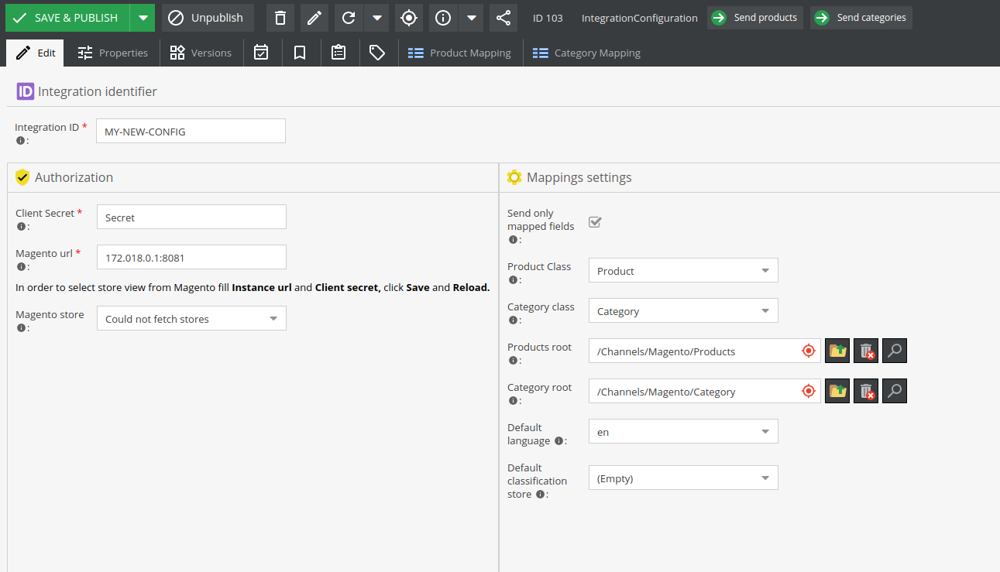

# <a name="integration-module"></a>Pimcore 5 Module Magento 2 Integration

Pimcore 5 Module Magento 2 Integration allows you to **integrate your Pimcore platform with Magento 2 e-commerce** and synchronize **products**, **categories** and **assets**!

**Table of Contents**

- [Pimcore 5 Module Magento 2 Integration](#integration-module)
	- [Description](#description)
	- [Compatibility](#compability)
	- [Requirements](#requirements)
	- [Installing/Getting started](#installing)
	- [Usage](#usage)
	- [Features](#features)
	- [Supported Pimcore types](#supported-types)
	- [Standards & Code Quality](#standards)
	- [About Authors](#authors)
	
## <a name="description"></a>Description	
This plugin allows to send all data about products and categories to remote eCommerce systems. 


## <a name="compability"></a>Compatibility	
Pimcore >= 5.1

## <a name="requirements"></a>Requirements
DivanteLtd/pimcore-devkit


## <a name="installing"></a>Installing/Getting started	
- Install via composer ```composer require magento2-pimcore5-bridge/pimcore5-module-magento2-integration:dev```
- Enable Bundles by running ```bin/console pimcore:bundle:enable DivanteMagentoIntegrationBundle```
- ```bin/console pimcore:bundle:enable DivanteObjectMapperBundle```
- Clear cache by running ```bin/console cache:clear --no-warmup```
- Install Bundle by running ```bin/console pimcore:bundle:install DivanteMagentoIntegrationBundle```
- Reload Pimcore
- Create a new object of class IntegrationConfiguration

## <a name="usage"></a>Usage

- Fill **Magento URL** and **Client Secret** with authorization data from your Magento2.
- Save class and reload it.
- If credentials were correct it will be possible to select **Magento store**, if not "**Could not fetch stores**" value will be displayed.
- Select classes that are used as a product and category class.
- Select products and categories synchronization root. When an object of one of the selected classes is published in given root it will be sent to Magento.
- Select default language used in synchronization. If a product has localized fields, only one version of this field will be sent.
- Select default classification store used in communication. This classification store will be used as an attribute set in Magento.
- Open tab Mappings.
- Fill left column with names of your fields in your classes. *That attribute names will be mapped to correct names used in communication with Magento*.
- Save and publish Integration Configuration object.

## <a name="features"></a>Features
- When a product / category meets criteria (published, in selected root tree, has correct type), information about publication is sent to Magento.
 Magento sends a request to Pimcore fetch object data and Pimcore responds with parsed, mapped object.
- Endpoints for fetching mapped products, categories.
- Indicators on product and category views that shows synchronization status. Available statuses: Sent, Ok, Error, Deleted.

- Any problem reported by Magento will be stored in object notes and inside Tools -> Application Logger.
- All assets, if attached to any synchronized product, when updated will be sent to Magento.
- Unpublished products will be sent to Magento as deleted. In order to disable product set **Enable** property to *false*.

## <a name="supported-types"></a>Supported Pimcore types
- Text
- Number
- Date
- Select
- Relation
- Classification store
- Object bricks
- Localized fields
- Image
- Image gallery
 
## <a name="standards"></a>Standards & Code Quality
This module respects PSR-2 code quality rule and our own PHPCS and PHPMD rulesets.

## <a name="authors"></a>About Authors


We are a Software House from Europe, existing from 2008 and employing about 150 people. Our core competencies are built around Magento, Pimcore and bespoke software projects (we love Symfony3, Node.js, Angular, React, Vue.js). We specialize in sophisticated integration projects trying to connect hardcore IT with good product design and UX.

We work for Clients like INTERSPORT, ING, Odlo, Onderdelenwinkel and CDP, the company that produced The Witcher game. We develop two projects: [Open Loyalty](http://www.openloyalty.io/ "Open Loyalty") - an open source loyalty program and [Vue.js Storefront](https://github.com/DivanteLtd/vue-storefront "Vue.js Storefront").

We are part of the OEX Group which is listed on the Warsaw Stock Exchange. Our annual revenue has been growing at a minimum of about 30% year on year.

Visit our website [Divante.co](https://divante.co/ "Divante.co") for more information.